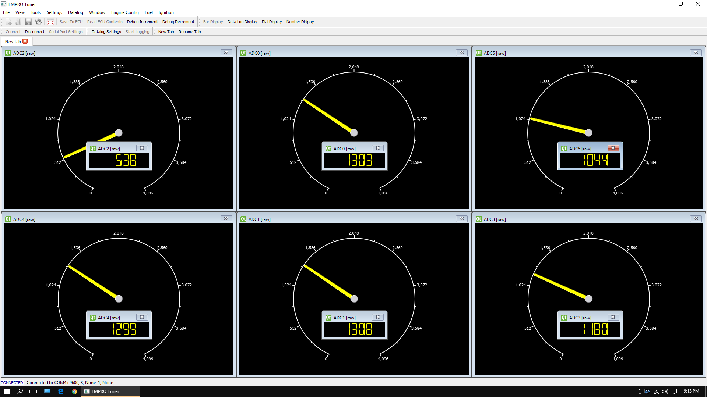

# ECU Tuner

Tuning software for my home made Engine Control Unit (ECU). Wrok in progress.

See readme in firmware folder.

## Screenshots

## Todo
- unreliable transfer working, partway through RDT protocol

## Done
- datalogViewControl widget: axis bounds indixes used, new log(n) axis bounds searching. new faster renderer, working margins, added current point markers, added with splitter for settings
- datalog view: y axis translate to centre and auto zoom, mouse snap to point, datapoint value printed on the side
- new round dial added
